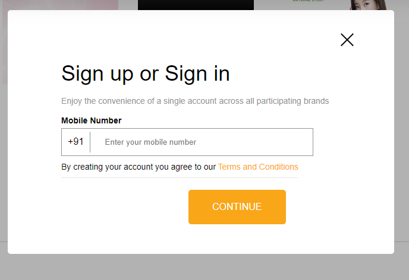
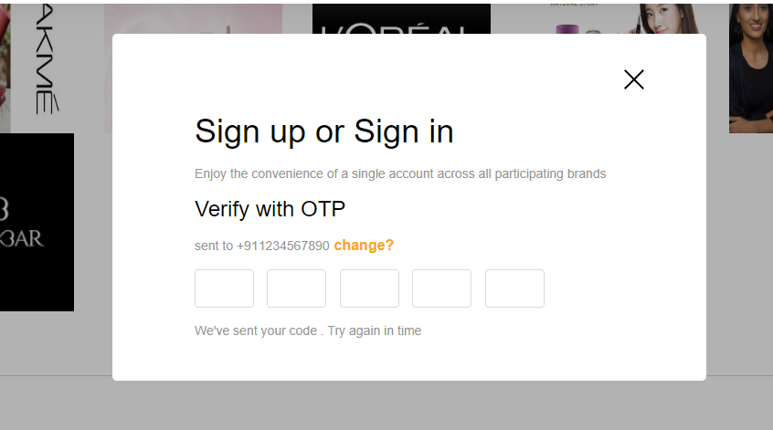
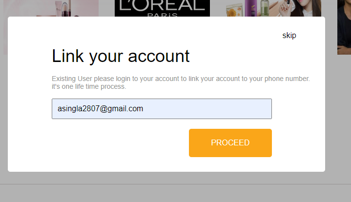
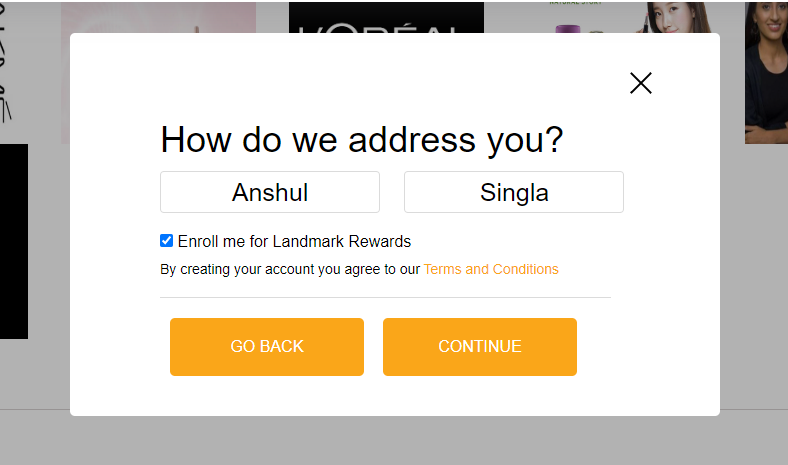

<h1 align="center"> Hi, Everyone <a href="https://reliable-llama-c038f5.netlify.app/" target="_blank"> Welcome </a></h1>
<h3 align="center" >-----  Created A clone of  -----</h3>
<h1 align="center"><a href="https://ubiquitous-moonbeam-0077c0.netlify.app/" target="_blank"> Lifestylestores.com</a></h1>

LifeStylestore is a online shoping website where you can purchase or sell products like cloths, bueaty, and other accesory. build with the six team members And completed the project in just 6 days before the deadline.

<h2 align="left"><i>Tech Stack Use for Creating a Lifestylestores.com clone</i></h2>

 

<h2 align="left"><i>You can find Deploy link here</i></h2>
<h3 align="left"><a href="https://ubiquitous-moonbeam-0077c0.netlify.app/" target="_blank"> Lifestylestore.com ( https://ubiquitous-moonbeam-0077c0.netlify.app )</a></h3>

<h2>Team Members<h2>

1.Vaibhav Ghawale 

2.Anshul Singla 

3.Amit Kumar

4.Chandan 

5.Sharun Khan 

6.Malaya Ranjan

<h2>Key Learning From Project</h2>

Got more Idea about implementing a HTML and CSS.

Cleared idea about how JavaScript ES6 concept use.

learn better use of Github for shearing a work.

Learn how to work with team.

learn how More effient way to plan a work.

project to biuld a more communication skills and also filled a communication gaps

<h2 align="left"><i> We Use Deploy tool:</i></h2>

  

<h2>Responsibilities<h2>
<h4> Malaya Ranjan </h4>
  
 Created a landing page with cool features:-

      <ul>
        <li>On hover Navbar</li>
        <li>Carousel</li>
        <li>Footer</li>
      </ul>
      

<h4>Anshul Singla</h4>
 
 Created a Login/SignUp form it is the sequence of 4 form with taking number , sending otp , checking weather it's correct or not , taking email , user details. 

 
 
 
 

<h4>Vaibhav Ghawale </h4>
 
 Created a payment page where user can move to final purchasing stage and connect booking page to all payment getway for more effient way user can easily make a order Also give a life API for finding a stores in located city. Make sure After payment user can see the payment process and All for understanding order is placed or not And all functionalities use us Javascript ES6 concept. 

  
<h1 align="center">  Thank You  </h1>
